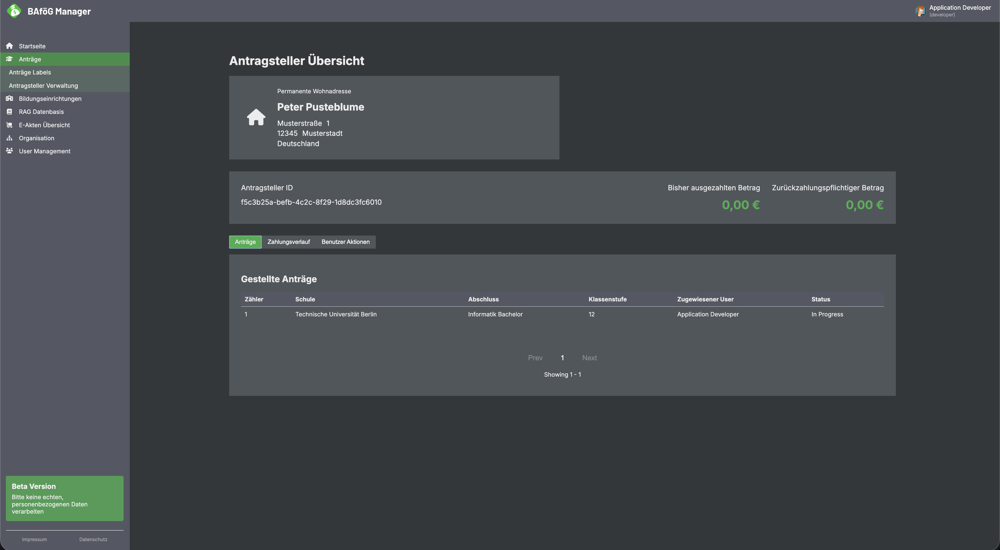
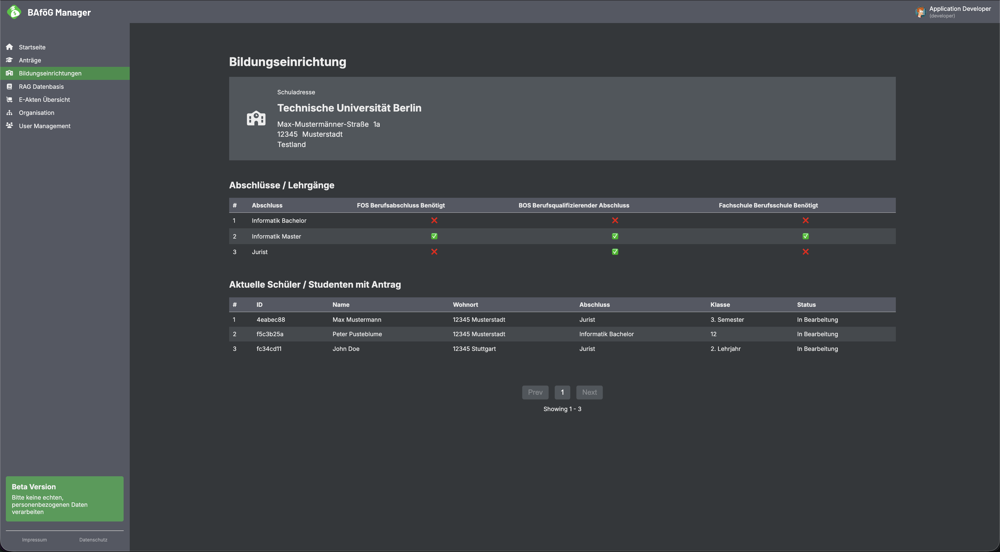
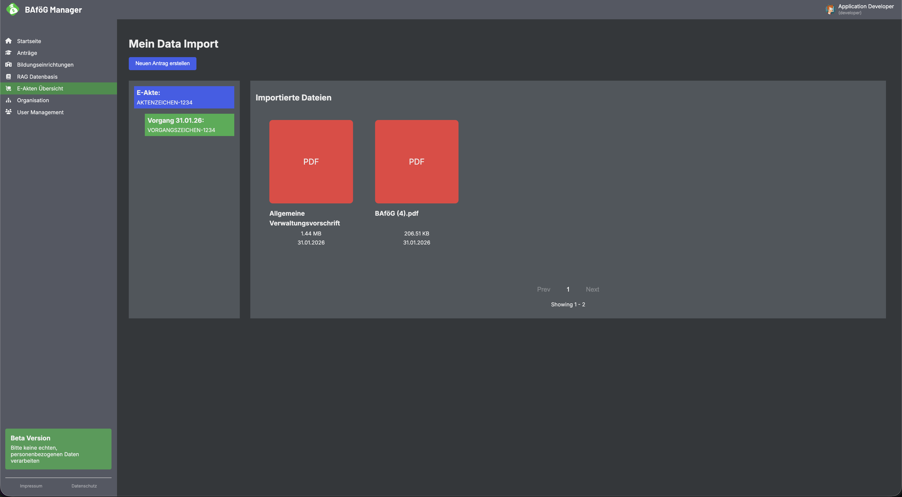

  

    <h1 align="center">BAföG Manager</h1>

 

Diese Anwendung wurde für BAföG Sachbearbeiter\*innen entwickelt, damit sie digitale und analoge Anträge in einem Portal bearbeiten können. Die Idee ist, alle relevanten Informationen für den Sachbearbeiter zu optimieren, notwenidge Kalkulationen bereits zu übernehmen und Anträge auf Vollständigkeit zu prüfen, bevor Sie ein Sachbearbeiter sieht.

Desweiteren ist geplant, das BVA für die BAföG Rückzahlungen in das System zu integrieren, damit es eine End-2-End-Digitalisierung wird und Daten während des Austausches durch XDomea (XÖR Schnittstelle) verloren gehen. Somit liefern der BaföG Manager optimale Workflows und Datensicherheit.

<table>
  <tr>
    <td>
      
    </td>
    <td>
      
    </td>
    <td>
      
    </td>
  </tr>
</table>

## ⚠️ Important: Virus Scanner Test Files Included

This project contains [EICAR test files](https://www.eicar.org/download-anti-malware-testfile/) to check if antivirus software is working correctly.

- They are not real viruses, but should be detected by security tools.
- This is expected and shows the antivirus is doing its job.
- Use at your own risk. If issues occur, please contact your antivirus vendor for support. Neither us, eicar nor clamav!

## Dev Notes

**Dependencies:**

- libwebp
- libvips
- libpopplerkit

**Set Secrets to run GitHub Actions:**

- CLAUDE_API_KEY
- GH_BOT_EMAIL
- RENOVATE_BOT_GITHUB_TOKEN
