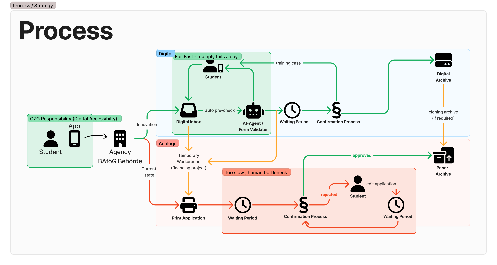

# Strategy of the project

We want to migrate the current process step by step so we avoid leaving any clerks behind who are against a digital process. At the beginning of this project there is already an app to submit bafög digital, but after submitting it, it gets printed out and processed on paper.

Here shines `DCS/BAföG`! We pick up that data via a message broker, display it only at first and start to evaluate the process step by step by being backwards compatible all the time. Steps in between are:

- auto printing applications after submitting it (we automate working students jobs)
- pre-evaluating applications before printing it (so it can be documented like before)
- digitalize all operations and only printing approved applications for documentation reasons

And the goal is a fully functional digital process

## Process Map

> Mindmap:
>
> 🟢 -> a good process  
> 🔴 -> current or bad process dicisions  
> 🟡 -> backwards compatible processes

